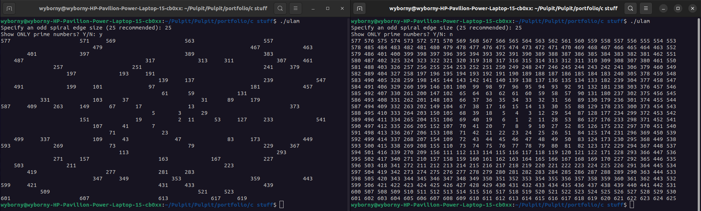

# Ulam Spiral in C

## What was the purpose of writing this program
I wanted to understand working with pointers and what's going on under the hood.

## What it can do
It's just ask some questions and show Ulam spiral according to the ansers.

_Just simple spiral_

